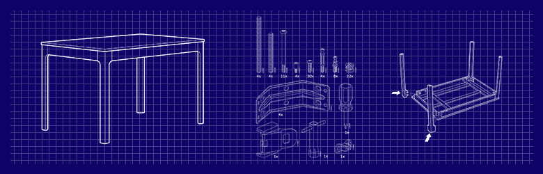

# Genisys
Generic hierarchical assembly tree for a manufacturing system

Genisys is a Django based generic hierarchical assembly platform that allows the freedom to define and create any product using sub-assemblies. Products could be sold individually or they could be assembled with other products (sub-assembly) to create yet another product (assembly) to be listed on the e-commerce store. In an example of an IKEA table-set, a table or chairs could be sold individually, or they could be assembled and create a product on its own. The goal is not to hardcode these products and product assemblies, but to allow staff to define these relations (blueprints) on a web portal and allow clients to customise bespoke items. 

### How to read this document
The content below will describe how this platform is designed and constructed. In many cases, a generic example is the best way to describe a problem set. I'll be repeatedly using the IKEA table-set as an example but bear in mind the platform is not designed for this sole purpose. 

### Design Principles
We have 4 distinct layers of object interactions. Atomic, Abstract, Builds and Orders. These reflect the 4 stages of initializing an e-commerce store. 

##### Atomic:
First, we have to define the lowest level of product - `AtomicComponent`, in which assemblies are built upon. These atomic components cannot be customized or altered by definition. One example would be a 5cm silver flat-head Phillips screw. 

##### Abstract layer:
After defining the atomic components, abstract layer helps to define rules for combining components to form builds. 

`Blueprint` defines how different sub-assembly can be put together to form a product. Eg. A table blueprint defines the product "table" is formed of 1x tabletop, 4x legs and 4x screws. The features that a blueprint requires is called prerequisites and there are 2 types of prerequisites. AtomicPrerequisite and BuildPrerequisites.

`AtomicPrerequisite` is the AtomicComponent that a blueprint requires. As AtomicComponent has no further Prerequisite by definition, they're relatively straightforward.

`BuildPrerequisite` defines the Build prerequisite in which the blueprint requires to build on top of (explanation of a Build is in the next section). An example would be a table set blueprint, it requires a table build in which itself has a further prerequisite. Therefore BuildPrerequisite has to be commonly resolved recursively.

Both prerequisites specify a range of quantity in which a blueprint can request. In cases like a table set, the BuildPrerequisite for chairs could be between 2 to 4. 

##### Build Layer:
`Build` defines a blueprint with a particular specification. Build should comply with the rule according to the blueprint by attaching Atomic/Build Specifications to meet each prerequisite defined in blueprint.

`AtomicSpecification` follows an AtomicPrerequisite with specifications complying to the range allowed.

`BuildSpecification` follows a BuildPrerequisite with specifications complying to the range allowed. Defining the builds needed in the lower levels.

